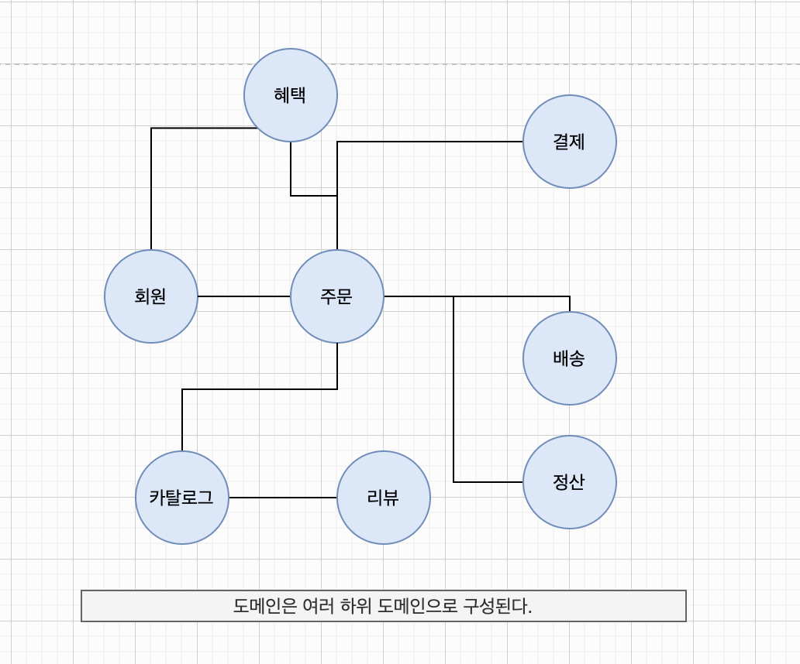
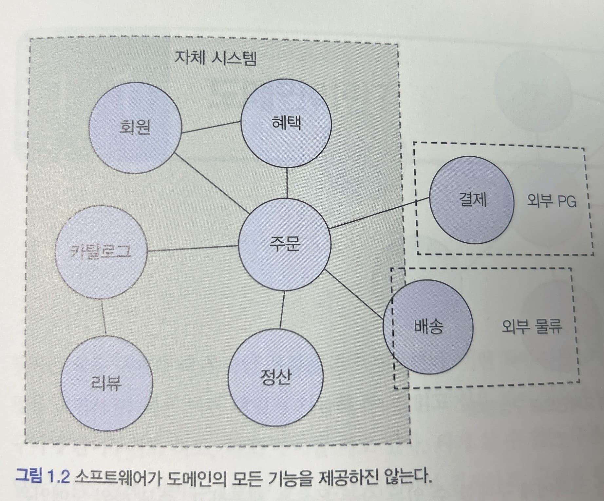
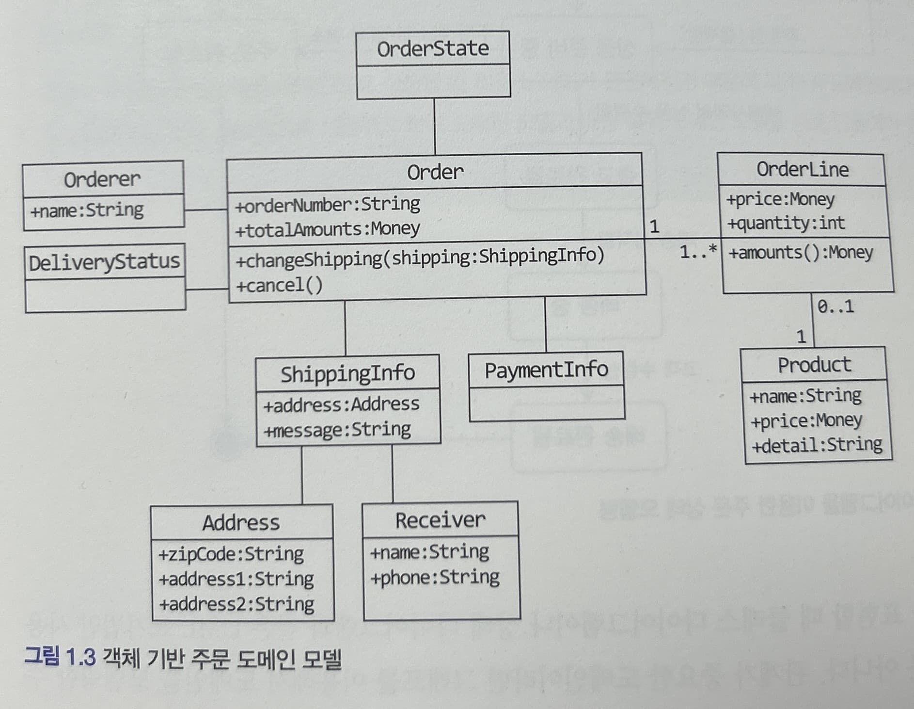
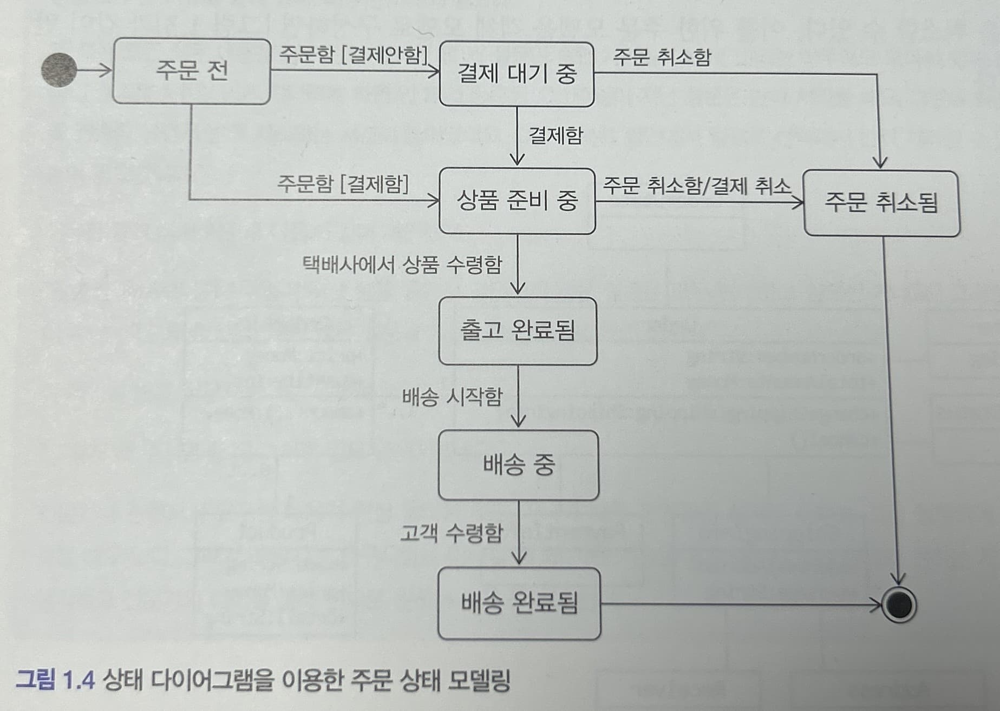
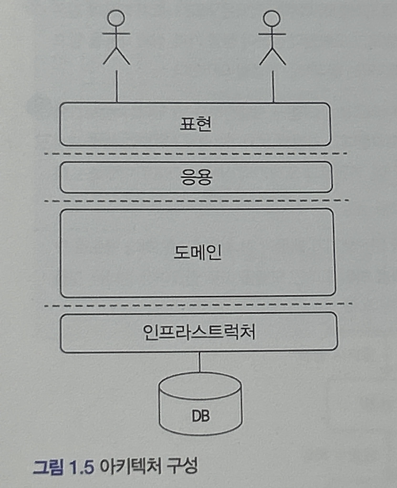

# 1. 도메인 모델 시작하기

## 도메인

### 1.1 도메인이란?

개발자 입장에서 바라보면 온라인 서점은 구현해야 할 소프트웨어와 대상이 된다.
온라인 서점 소프트웨어는 온라인으로 책을 판매하는 데 필요한 상품 조회, 구매, 결제, 배송 추적 등의 기능을 제공해야 한다. 이때 온라인 서점은 소프트웨어로 해결하고자 하는 문제 영역, 즉 도메인(`domain`)에 해당한다.

***한 도메인은 다시 하위 도메인으로 나눌 수 있다.***

예를 들어 온라인 서점 도메인은 그림과 같이 몇 개의 하위 도메인으로 나눌 수 있다.



- 카탈로그 하위 도메인은 고객에게 구매할 수 있는 상품 목록을 제공
- 주문 하위 도메인은 고객의 주문을 처리
- 혜택 하위 도메인은 쿠폰이나 특별 할인과 같은 서비스를 제공
- 배송 하위 도메인은 고객에게 구매한 상품을 전달하는 일련의 과정을 처리

한 하위 도메인은 다른 하위 도메인과 연동하여 완전한 기능을 제공한다. 예를 들어 고객이 물건을 구매하면 주문, 결제, 배송, 혜택 하위 도메인의 기능이 엮이게 된다.

***특정 도메인을 위한 소프트웨어라고 해서 도메인이 제공해야 할 모든 기능을 직접 구현하는 겻은 아니다.***



그림[1.2]과 같이 배송 도메인의 일부 기능은 자체 시스템으로 구현하고, 나머지 기능은 외부 업체의 시스템을 사용하고 결제 시스템도 직접 구현하기보다는 결제 대행 업체를 이요해서 처리할 때가 많다.

***도메인마다 고정된 하위 도메인이 존재하는 것은 아니다.***

하위 도메인을 어떻게 구성할지 여부는 상황에 따라 달라진다. 기업 고객을 대상으로 대형 장비를 판매하는 곳은 온라인으로 카탈로그를 제공하고 주문서를 받는 정도만 필요할 것이다. 온라인 결제나 배송 추적과 같은 기능을 제공할 필요가 없다.

반면에 의류나 액세서리처럼 일반 고객을 대상으로 물건을 판매한다면 카탈로그, 리뷰, 주문, 결제 , 배송, 회원 기능 등이 필요할 것이다.

### 1.2 도메인 전문가와 개발자 간 지식 공유

온라인 홍보, 정산, 배송 등 각 영역에는 전문가가 있다. 이들 전문가는 해당 도메인에 대한 지식과 경험을 바탕으로 본인들이 원하는 기능 개발을 요구한다.
예를 들어 회계 담당자는 엑셀로 맞추던 정산 금액 계산을 자동화해 주는 기능을 요구할 수 있다.
AS 기사는 고객에게 보내는 문자 메시지를 빠르게 입력할 수 있는 템플릿 추천 기능을 요구할 수 있다.

**개발자는 이런 요구사항을 분석하고 설계하여 코드를 작성하며 테스트하고 배포한다. 이 과정에서 요구사항은 첫 단추와 같다.** 첫 단추를 잘못 끼우면 모든 단추가 잘못 끼워지듯이 요구사항을 올바르게 이해하지 못하면 요구하지 않은 엉뚱한 기능을 만들게 된다. 잘못 개발한 코드를 수정해서 올바르게 고치려면 많은 노력이 든다.

그래서 **코딩에 앞서 요구사항을 올바르게 이해하는 것이 중요하다**. 요구사항을 제대로 이해하지 않으면 쓸모없거나 유용함이 떨어지는 시스템을 만들기 때문이다. 요구사항을 잘못 이해하면 변경하거나 다시 만들어야 할 코드가 많아지고 경우에 따라 소프트웨어, 즉 제품을 만드는데 실패하거나 일정이 크게 밀리기도 한다. 아쉽게도 이런 문제는 자주 발생한다.

요구사항을 올바르게 이해하려면 어떻게 해야하나? 여러 방법이 있겠지만 비교적 간단한 방법이 있다. 그것은 바로 **개발자와 전문가가 직접 대화하는 것이다.** 개발자와 전문가 사이에 내용을 전파하는 전달자가 많으면 많을수록 정보가 왜곡되고 손실이 발생하게 되며, 개발자는 최초에 전문가가 요구한 것과는 다른 무언가를 만들게 된다.

도메인 전문가 만큼은 아니겠지만 이해관계자와 개발자도 도메인 지식을 갖춰야 한다. 제품 개발과 관련된 도메인 전문가, 관계자, 개발자가 같은 지식을 공유하고 직접 소통할수록 도메인 전문가가 원하는 제품을 만들 가능성이 높아진다.

> **”Garbage in, Garbage out”**
’Garbage in, Garbage out’은 소프트웨어 분야에서 유명한 문장으로 ‘잘못된 값이 들어가면 잘못된 결과가 나온다’는 의미를 갖는다. 이 말은 요구사항에도 적용된다. 잘못된 요구사항이 들어가면 잘못된 제품이 나온다.
>
>개발자가 도메인 전문가와 직접 소통할수록 요구사항이 변질될 가능성이 줄지만 도메인 전문가라고 해서 항상 올바른 요구사항을 주는 것은 아니다. 도메인 전문가가 소프트웨어 전문가는 아니기 때문에 기존에 만들어진 소프트웨어를 기준으로 요구사항을 맞출 때가 있다.
>
>예를 들어보자. 사용자가 직접 문항을 등록해서 설문 조사를 할 수 있는 기능이 있다고 가정하자. 담당자는 매일 오전에 등록된 설문을 보고 승인하거나 반려하는 운영 업무를 진행한다. 설문 등록 건수가 늘면서 담당자는 다음과 같은 기능을 요구했다.
>
>”현재 목록에 있는 전체 설문을 한번에 선택하고 반려하는 기능”
>
>기능을 구현하는 것이 어렵진 않았지만 기능으로 요구한 의도가 궁금해서 담당자와 대화를 했는데 그 과정에서 이 기능을 요구한 이유를 알게 됐다. 이유는 아래와 같았다.
>
>”등록된 모든 설문 내용을 볼 시간이 없어서 몇 개 설문만 승인 처리를 하는데, 반려는 아무래도 모아서 하게 됩니다. 승인 결과를 1주일 넘게 기다리게 하면 안 돼서 등록된 지 1주일이 지난 설문은 반려 처리를 해요. 그런데 최근에 등록 건수가 늘면서 반려 처리하는 시간이 늘어났어도. 그래서 목록 화면에서 일괄로 선택해서 반려 처리할 수 있는 기능이 필요합니다.”
>
>이유를 듣고 나서 거꾸로 다음과 같이 제안했다.
>
>”말씀을 들어보니까 1주일이 지난 설문 중에서 승인하지 않은 설문은 모두 반려하고 싶으신 거네요? 그러면 1주일이 지난 설문 중에서 승인하지 않은 설문을 자동으로 반려 처리하면 될까요?”
>
>이 제안을 듣고 담당자는 웃는 얼굴로 답했다.
>
>”그렇게 해 주시면 좋죠! 그러면 일도 편해지겠네요.”
>
>전문가나 관련자가 요구한 내용이 항상 올바른 것은 아니며 때론 본인들이 실제로 원하는 것을 정확하게 표현하지 못할 때도 있다. 그래서 개발자는 요구사항을 이해할 때 왜 이런 기능을 요구하는지 또는 실제로 원하는 게 무엇인지 생각하고 전문가와 대화를 통해 진짜로 원하는 것을 찾아야 한다.

### 1.3 도메인 모델

도메인 모델에는 다양한 정의가 존재하는데, 기본적으로 도메인 모델은 특정 도메인을 개념적으로 표현한 것이다.
주문 도메인을 생각해 보자. 온라인 쇼핑몰에서 주문을 하려면 상품을 몇개 살지 선택하고 배송지를 입력한다.
선택한 상품 가격을 이용해서 총 지불 금액을 계산하고, 금액 지불을 위한 결제 수단을 선택한다.
주문한 뒤에도 배송 전이면 배송지 주소를 변경하거나 주문을 취소할 수 있다.
이를 위한 주문 모델을 객체 모델로 구성하면 그림[1.3]과 같이 만들 수 있다.



그림[1.3]의 모델은 도메인의 모든 내용을 담고 있지는 않지만 이 모델을 보면 주문(`Order`)은 주문번호(`orderNumber`)와 지불할 총금액(`totalAmounts`)이 있고, 배송정보(`ShippingInfo`)를 변경(`changeShipping`)을 할 수 있음을 알 수 있다. 또한 주문을 취소(`cancel`) 할 수 있다는 것도 알 수 있다. 도메인 모델을 사용하면 여러 관계자들이 동일한 모습으로 도메인을 이해하고 도메인 지식을 공유하는 데 도움이 된다.

위의 그림은 객체를 이용한 도메인 모델이다. 도메인을 이해하려면 도메인이 제공하는 기능과 도메인의 주요 데이터 구성을 파악해야 하는데, 이런 면에서 기능과 데이터를 함께 보여주는 객체 모델은 도메인을 모델링하기에 적합하다.



그림[1.4]는 상태 다이어그램을 이용해서 주문의 상태 전이를 모델링한 그림이다. 이 다이어그램을 보면 상품 준비 중 상태에서 주문을 취소하면 결제 취소가 함께 이루어진다는 것을 알 수 있다.

> 참고: 도메인 모델을 표현할 때 클래스 다이어그램이나 상태 다이어그램과 같은 UML 표기법만 사용해야 하는 것은 아니다. 관계가 중요한 도메인이라면 그래프를 이용해서 도메인을 모델링할 수 있다. 계산 규칙이 중요하다면 수학 공식을 활용해서 도메인 모델을 만들 수도 있다. 도메인을 이애하는 데 도움이 된다면 표현 방식이 무엇인지는 중요하지 않다.
>

- 도메인 모델은 기본적으로 도메인 자체를 이해하기 위한 개념 모델이다.
- 개념 모델을 이용해서 바로 코드를 작성할 수 있는 것은 아니기에 구현 기술에 맞는 구현 모델이 따로 필요하다.
- 개념 모델과 구현 모델은 서로 다른 것이지만 구현 모델이 개념 모델을 최대한 따르도록 할 수는 있다.
- ex)
1. 객체 기반 모델을 기반으로 도메인을 표현했다면 객체 지향 언어를 이용해 개념 모델에 가깝게 구현할 수 있다.
2. 수학적인 모델을 사용한다면 함수를 이용해서 도메인 모델과 유사한 구현 모델을 만들 수 있다.

> **하위 도메인과 모델**
앞서 말했든 도메인은 다수의 하위 도메인으로 구성된다. 각 하위 도메인이 다루는 영역은 서로 다르기 때문에 같은 용어라도 하위 도메인마다 의미가 달라질 수 있다. 예를 들어 카탈로그 도메인의 상품이 상품 가격, 상세 내용을 담고 있는 정보를 의미한다면 배송 도메인의 상품은 고객에게 실제 배송되는 물리적인 상품을 의미한다.
>
>도메인에 따라 용어 의미가 결정되므로 여러 하위 도메인을 하나의 다이어그램에 모델링하면 안 된다. 카탈로그와 배송 도메인 모델을 구분하지 않고 하나의 다이어그램에 함께 표시한다고 가정해 보자. 이 경우 다이어그램에 표시한 상품은 카탈로그의 상품과 배송의 상품 의미를 함께 제공하기에, 카탈로그 도메인의 상품을 제대로 이해하는 데 방해가 된다.
>
>모델의 각 구성요소는 특정 도메인으로 한정할 때 비로소 의미가 완전해지기 때문에 각 하위 도메인마다 별도로 모델을 만들어야 한다. 결과적으로 카탈로그 하위 도메인 모델과 배송 하위 도메인 모델을 따로 만들어야 한다는 것을 뜻한다.

### 1.4 도메인 모델 패턴

일반적인 애플리케이션의 아키텍처는 [그림 1.5]와 같이 네 개의 영역으로 구성된다.



| 영역 | 설명 |
| --- | --- |
| 사용자 인터페이스 UI
또는 표현 Presentation | 사용자의 요청을 처리하고 사용자에게 정보를 보여준다. 여기서 사용자는 소프트웨어를 사용하는 사람뿐만 아니라 외부 시스템일 수도 있다. |
| 응용 Application | 사용자가 요청한 기능을 실행한다. 업무 로직을 직접 구현하지 않으며 도메인 계층을 조합해서 기능을 실행한다. |
| 도메인 | 시스템이 제공할 도메인 규칙을 구현한다. |
| 인프라스트럭처 Infrastructure | 데이터베이스나 메시징 시스템과 같은 외부 시스템과의 연동을 처리한다. |

앞서 살펴본 도메인 모델이 도메인 자체를 이해하는 데 **필요한 개념 모델**을 의미한다면, **지금 살펴볼 도메인 모델은 아키텍처 상의 도메인 계층을 객체 지향 기법으로 구현하는 패턴을 말한다.**

**도메인 계층은 도메인의 핵심 규칙을 구현**한다. 주문 도메인의 경우 ‘출고 전에 배송지를 밴경할 수 있다.’라는 규칙과 ‘주문 취소는 배송 전에만 할 수 있다’라는 규칙을 구현한 코드가 도메인 계층에 위치하게 된다. 이런 **도메인 규칙을 객체 지향 기법으로 구현하는 패턴이 도메인 모델 패턴**이다.

예를 들어 다음 코드를 보자.

```java
public class Order {
	private OrderState state;
	private ShippingInfo shippingInfo;

	public void changeShippingInfo(ShippingInfo newShippingInfo) {
		if (!state.isShippingChangeable()) {
			throw new IllegalStateException("cat't change shipping in " + state);
		}
		this.shippingInfo = newShippingInfo;
	}
	...
}

public enum OrderState {
	PAYMENT_WAITING {
		public boolean isShippingChangeable() {
			return true;
		}
	},
	PREPARING {
		public boolean isShippingChangeable() {
			return true;
		}
	},
	SHIPPED, DELIVERING, DELIVERY_COMPLETED;

	public boolean isShippingChangeable() {
		return false;
	}
}
```

이 코드는 주문 도메인의 일부 기능을 도메인 모델 패턴으로 구현한 것이다. 주문 상태를 표현하는 `OrderState`는 배송지를 변경할 수 있는지를 검사할 수 있는 `isShippingChangeable()`메서드를 제공하고 있다. 코드를 보면 주문 대기중(`PAYMENT_WAITING`) 상태와 상품 준비 중(`PREPARING`) 상태의 `isShippingChangeable()` 메서드는 true를 리턴한다. 즉 `OrderState`는 주문 대기 중이거나 상품 준비 중에는 배송지를 변경할 수 있다는 도메인 규칙을 구현하고 있다.

실제 배송지 정보를 변경하는 `Order` 클래스의 `changeShippingInfo()` 메서드는 `OrderState`의 `isShippingChangeable()` 메서드를 이용해서 변경 가능한 경우에만 배송지를 변경한다.

큰 틀에서 보면 `OrderState`는 `Order`에 속한 데이터이므로 배송지 정보 변경 가능 여부를 판단하는 코드를 `Order`로 이동할 수 있다. 다음은 `Order` 클래스에서 판단하도록 수정한 코드를 보여주고 있다.

```java
public class Order {
	private OrderState state;
	private ShippingInfo shippingInfo;

	public void changeShippingInfo(ShippingInfo newShippingInfo) {
		if (!isShippingChangeable()) {
			throw new IllegalStateException("can't change shipping in " + state);
		}
	}

	private boolean isShippingChangeable() {
		return state == OrderState.PAYMENT_WAITING ||
			state == OrderState.PREPARING;
	}
	...
}

public enum OrderState {
	PAYMENT_WAITING, PREPARING, SHIPPED, DELIVERING, DELIVERY_COMPLETED;
}
```

배송지 변경이 가능한지를 판단할 규칙이 주문 상태와 다른 정보를 함께 사용한다면 `OrderState`만으로는 배송지 변경 가능 여부를 판단할 수 없으므로 `Order`에서 로직을 구현해야 한다.

배송지 변경 가능 여부를 판단하는 기능이 `Order`에 있든 `OrderState`에 있든 중요한 점은 주문과 관련된 중요 업무 규칙을 주문 도메인 모델인 `Order`나 `OrderState`에서 구현한다는 점이다. 핵심 규칙을 구현한 코드는 도메인 모델에만 위치하기 때문에 규칙이 바뀌거나 규칙을 확장해야 할 때 다른 코드에 영향을 덜 주고 변경 내역을 모델에 반영할 수 있게 된다.

> ‘도메인 모델’이란 용어는 도메인 자체를 표현하는 개념적인 모델을 의미하지만, 도메인 계층을 구현할 때 사용하는 객체 모델을 언급할 때에도 ‘도메인 모델’이란 용어를 사용한다. 이 책에서도 도메인 계층의 객체 모델을 표현할 때 도메인 모델이라고 표현하고 있다.
>

> **개념 모델과 구현 모델**
개념 모델은 순수하게 문제를 분석한 결과물이다. 개념 모델은 데이터베이스, 트랜잭션 처리, 성능, 구현 기술과 같은 것을 고려하고 있지 않기 때문에 실제 코드를 작성할 때 개념 모델을 있는 그대로 사용할 수 없다. 그래서 개념 모델을 구현 가능한 형태의 모델로 전환하는 과정을 거치게 된다.
>
>개념 모델을 만들 때 처음부터 완벽하게 도메인을 표현하는 모델을 만드는 시도를 할 수 있지만 실제로 이것은 불가능하다. 소프트웨어를 개발하는 동안 개발자와 관계자들은 해당 도메인을 더 잘 이해하게 된다. 프로젝트 초기에 이해한 도메인 지식이 시간이 지나 새로운 통찰을 얻으면서 완전히 다른 의미로 해석되는 경우도 있다. 프로젝트 초기에 완벽한 도메인 모델을 만들더라도 결국 도메인에 대한 새로운 지식이 쌓이면서 모델을 보완하거나 변경하는 일이 발생한다.
>
>따라서 처음부터 완벽한 개념 모델을 만들기보다는 전반적인 개요를 알 수 있는 수준으로 개념 모델을 작성해야 한다. 프로젝트 초기에는 개요 수준의 개념 모델로 도메인에 대한 전체 윤곽을 이해하는 데 집중하고, 구현하는 과정서 개념 모델을 구현 모델로 점진적으로 발전시켜 나가야 한다.

### 1.5 도메인 모델 도출

제 아무리 뛰어난 개발자라 할지라도 도메인에 대한 이해 없이 코딩을 시작할 수는 없다. 기획서, 유스케이스, 사용자 스토리와 같은 **요구사항과 관련자와의 대화를 통해 도메인을 이해하고 이를 바탕으로 도메인 모델 초안을 만들어야 비로소 코드를 작성**할 수 있다. 화이트보드, 종이와 연필, 모델링 툴 중 무엇을 선택하든 구현을 시작하려면 도메인에 대한 초기 모델이 필요하다.

**도메인을 모델링할 때 기본이 되는 작업은 모델을 구성하는 핵심 구성요소, 규칙, 기능을 찾는 것이다. 이 과정은 요구사항에서 출발**한다. 주문 도메인과 관련된 몇 가지 요구사항을 보자.

- 최소 한 종류 이상의 상품을 주문해야 한다.
- 한 상품을 한 개 이상 주문할 수 있다.
- 총 주문 금액은 각 상품의 구매 가격 합을 모두 더한 금액이다.
- 각 상품의 구매 가격 합은 상품 가격에 구매 개수를 곱한 값이다.
- 주문할 때 배송지 정보를 반드시 지정해야 한다.
- 배송지 정보는 받는 사람 이름, 전화번호, 주소로 구성된다.
- 출고를 하면 배송지를 변경할 수 없다.
- 출고 전에 주문을 취소할 수 있다.
- 고객이 결제를 완료하기 전에는 상품을 준비하지 않는다.

이 요구사항에서 알 수 있는 것은 주문은 `출고 상태로 변경하기`, `배송지 정보 변경하기`, `주문 취소하기`, `결제 완료하기` 기능을 제공한다는 것이다. 아직 상세 구현까지 할 수 있는 수준은 아니지만 `Order`에 관련 기능을 메서드로 추가할 수 있다.

```java
public class Order {
	public void changeShipped() { ... }
	public void changeShippingInfo(ShippingInfo newShipping) { ... }
	public void cancel() { ... }
	public void completePayment() { ... }
}
```

다음 요구사항은 주문 항목이 어떤 데이터로 구성되는지 알려준다.

- 한 상품을 한 개 이상 주문할 수 있다.
- 각 상품의 구매 가격 합은 상품 가격에 구매 개수를 곱한 값이다.

두 요구사항에 따르면 주문 항목을 표현하는 `OrderLine`은 적어도 주문할 상품, 상품의 가격, 구매 개수를 포함해야 한다. 추가로 각 구매 항목의 구매 가격도 제공해야 한다. 이를 구현한 `OrderLine`은 다음과 같다.

```java
public class OrderLine {
	private Product product;
	private int price;
	private int quantity;
	private int amounts;

	public OrderLine(Product product, int price, int quantity) {
		this.product = product;
		this.price = price;
		this.quantity = quantity;
		this.amounts = calculateAmounts();
	}

	private int calculateAmounts() {
		return price * quantity;
	}

	public int getAmounts() { ... }
	...
}
```

`OrderLine`은 한 상품(product 필드)을 얼마에(price 필드) 몇 개 살지(quantity 필드)를 담고 있고 `calculateAmounts()`메서드로 구매 가격을 구하는 로직을 구현하고 있다.

다음 요구사항은 `Order`와 `OrderLine`과의 관계를 알려준다.

- 최소 한 종류 이상의 상품을 주문해야 한다.
- 총 주문 금액은 각 상품의 구매 가격 합을 모두 더한 금액이다.

한 종류 이상의 상품을 주문할 수 있으므로 `Order`는 최소 한 개 이상의 `OrderLine`을 포함해야 한다. 또한 총 주문 금액은 `OrderLine`에서 구할 수 있다. 두 요구사항은 `Order`에 다음과 같이 반영할 수 있다.

```java
public class Order {
	private List<OrderLine> orderLines;
	private Monty totalAmounts;

	public Order(List<OrderLine> orderLines) {
		setOrderLines(orderLines);
	}

	private void setOrderLines(List<OrderLine> orderLines) {
		verifyAtLeastOneOrMoreOrderLines(orderLines);
		this.orderLines = orderLines;
		calculateTotalAmounts();
	}

	private void verifyAtLeastOneOrMoreOrderLines(List<OrderLine> orderLines) {
		if (orderLines == null || orderLines.isEmpty()) {
			throw new IllegalArgumentException("no OrderLine");
		}
	}

	private void calculateTotalAmounts() {
		int sum = orderLines.stream()
												.mapToInt(x -> x.getAmounts())
												.sum();
		this.totalAmounts = new Money(sum);
	}
	... // 다른 메서드
}
```

`Order`는 한 개 이상의 `OrderLine`을 가질 수 있으므로 `Order`를 생성할 때 `OrderLine` 목록을 List로 전달한다. 생성자에서 호출하는 `setOrderLines()` 메서드는 요구사항에 정의한 제약 조건을 검사한다. 요구사항에 따르면 최소 한 종류 이상의 상품을 주문해야 하므로 `verifyAtLeastOneOrMoreOrderLines()` 메서드를 이용해서 `OrderLines`이 한 개 이상 존재하는지 검사한다. 또한 `calculateTotalAmounts()` 메서드를 이용해서 총 주문 금액을 계산한다.

배송지 정보는 이름, 전화번호, 주소 데이터를 가지므로 `ShippingInfo` 클래스를 다음과 같이 정의할 수 있다.

```java
public class ShippingInfo {
	private String receiverName;
	private String receiverPhoneNumber;
	private String shippingAddress1;
	private String shippingAddress2;
	private String shippingZipcode;

	... 생성자, getter
}
```

앞서 요구사항 중에 ‘주문할 때 배송지 정보를 반드시 지정해야 한다’라는 내용이 있다. 이는 `Order`를 생성할 때 `OrderLine`의 목록뿐만 아니라 `ShippingInfo`도 함께 전달해야 함을 의미한다. 이를 생성자에 반영한다.

```java
public class Order {
	private List<OrderLine> orderLines;
	private ShippingInfo shippingInfo;
	...

	public Order(List<OrderLine> orderLines, ShippingInfo shippingInfo) {
		setOrderLines(orderLines);
		setShippingInfo(shippingInfo);
	}

	private void setShippingInfo(ShippingInfo shippingInfo) {
		if (shippingInfo == null)
			throw new IllegalArgumentException("no ShippingInfo");
		this.shippingInfo = shippingInfo;
	}
	...
}
```

**생성자에서 호출하는 `setShippingInfo()` 메서드는 `ShippingInfo`가 null이면 익셉션이 발생하는데, 이렇게 함으로써 ‘배송지 정보 필수’라는 도메인 규칙을 구현**한다.

도메인을 구현하다 보면 특정 조건이나 상태에 따라 제약이나 규칙이 달리 적용되는 경우가 많다. 주문 요구사항에서는 다음 내용이 제약과 규칙에 해당된다.

- 출고를 하면 배송지 정보를 변경할 수 없다.
- 출고 전에 주문을 취소할 수 있다.

이 요구사항은 출고 상태가 되기 전과 후의 제약사항을 기술하고 있다. **출고 상태에 따라 배송지 정보 변경 기능과 주문 취소 기능은 다른 제약을 갖는다. 이 요구사항을 충족하려면 주문은 최소한 출고 상태를 표현할 수 있어야 한다.**

다음 요구사항도 상태와 관련이 있다.

- 고객이 결제를 완료하기 전에는 상품을 준비하지 않는다.

**이 요구사항은 결제 완료 전을 의미하는 상태와 결제 완료 내지 상품 준비 중이라는 상태가 필요함을 알려준다.** 다른 요구사항을 확인해서 추가로 존재할 수 있는 상태를 분석한 뒤, 다음과 같이 열거 타입을 이용해서 상태 정보를 표현할 수 있다.

```java
public enum OrderState {
	PAYMENT_WAITING, PREPARING, SHIPPED, DELIVERING, DELIVERY_COMPLETED,
	CANCELED;
}
```

배송지 변경이나 주문 취소 기능은 출고 전에만 가능하다는 제약 규칙이 있으므로 이 규칙을 적용하기 위해 `changeShippingInfo()`와 `cancel()`은 `verifyNotYetShipped()` 메소드를 먼저 실행한다.

```java
public class Order {
	private OrderState state;

	public void changeShippingInfo(ShippingInfo newShippingInfo) {
		verifyNotYetShipped();
		setShippingInfo(newShippingInfo);
	}

	public void cancel() {
		verifyNotYetShipped();
		this.state = OrderState.CANCELED;
	}

	private void verifyNotYetShipped() {
		if (state != OrderState.PAYMENT_WAITING && state != OrderState.PREPARING)
			throw new IllegalStateException("aleady shipped");
	}
	...
}
```

지금까지 주문과 관련된 요구사항에서 도메인 모델을 점진적으로 만들어 나갔다. 일부는 구현 수준까지 만들었고 일부는 이름 정도만 결정했다. 이렇게 만든 모델은 요구사항 정련을 위해 도메인 전문가나 다른 개발자와 논의하는 과정에서 공유하기도 한다. 모델을 공유할 때는 화이트보드나 위키와 같은 도구를 사용해서 누구나 쉽게 접근할 수 있도록 하면 좋다.

> **문서화**
문서화를 하는 주된 이유는 지식을 공유하기 위함이다. 실제 구현은 코드에 있으므로 코드를 보면 다 알 수 있지만 코드는 상세한 모든 내용을 다루고 있기 때문에 코드를 이용해서 전체 소프트웨어를 분석하려면 많은 시간을 투자해야 한다. 전반적인 기능 목록이나 모듈 구조, 빌드 과정은 코드를 보고 직접 이해하는 것보다 상위 수준에서 정리한 문서를 참조하는 것이 소프트웨어 전반을 빠르게 이해하는 데 도움이 된다. 전체 구조를 이해하고 더 깊게 이해할 필요가 있는 부분을 코드로 분석해 나가면 된다.
> 
>코드를 보면서 도메인을 깊게 이해하게 되므로 코드 자체도 문서화의 대상이 된다. 도메인 지식이 잘 묻어나도록 코드를 작성하지 않으면 코드의 동작 과정은 해석할 수 있어도 도메인 관점에서 왜 코드를 그렇게 작성했는지 이해하는 데는 도움이 되지 않는다. 단순히 코드를 보기 좋게 작성하는 것뿐만 아니라 도메인 관점에서 코드가 도메인을 잘 표현해야 비로소 코드의 가독성이 높아지고 문서로서 코드가 의미를 갖는다.
